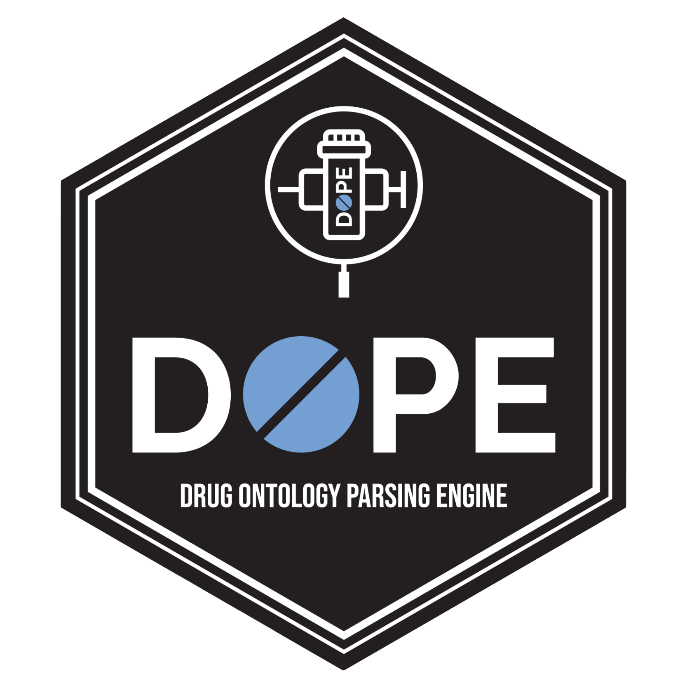
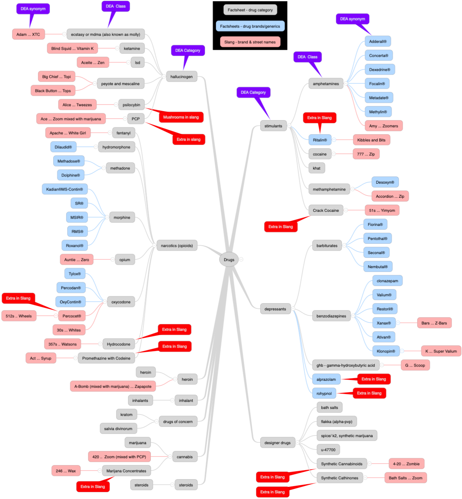

# Drug Ontology Parsing Engine (DOPE) <a href='https://ctn-0094.github.io/DOPE/'></a>

<!-- badges: start -->
  [](https://CRAN.R-project.org/package=DOPE)
  [](https://www.tidyverse.org/lifecycle/#maturing)
<!-- badges: end -->

The goal of DOPE is to provide a structured vocabulary and tools to look up details on drugs tracked by the DEA.  The data structure is:



## Installation

### Official Release
You can install the released version of DOPE from [CRAN](https://CRAN.R-project.org) with:

``` r
install.packages("DOPE")
```


### Development Release
Run these two lines of code to install tidyREDCap from GitHub (this requires RTools for Windows or Xcode for Mac to be installed on your computer):

``` r
if (!requireNamespace("devtools")) install.packages("devtools")
devtools::install_github("labouz/DOPE")
```

## Examples

You can look up details on a drug with the `lookup()` function.  It will check brand, generic and street names.

``` r
library(DOPE)
lookup("adderall")
lookup("ketamine")
lookup("auntie")
```

The lookup funciton supports vectorized lookups:
```
library(DOPE)
lookup("cheese", "pizza", "with", "a", "soda")
```

If your only care about the category and/or class and/or if you serach returns many matches you can use the compress_lookup() function to drop columns and then remove duplicate rorws.

```
lookup("cheese", "pizza", "with", "a", "soda") %>% 
  compress_lookup(compressCategory = FALSE,
                  compressClass = TRUE,
                  compressSynonym = TRUE)
```

